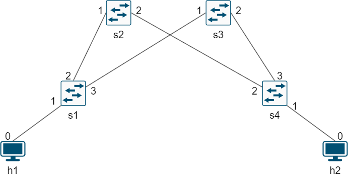

# ReadMe

This repository is a fork of project [p4-sfc](https://github.com/multip4/P4-SFC), it has some bug/inconsistenciy fixes, and 
contains the necessary parts to run the BMv2 version of the P4 code.

It is a version of the same project but already inserted in the directories of [p4lang/tutorials](https://github.com/p4lang/tutorials), because of it's dependencies, making it ready to run on the VMs available at  [p4lang/tutorials](https://github.com/p4lang/tutorials) (most recent version at 20/10/2024)


## Topology



## Fixes
There were inconsistencies in what was refered as `TOS` and `DSCP` in the project, now they are consitent:

* For the P4 code and its .json files with table entries, `TOS` was just the 6 LMS bits of `TOS`, which is `DSCP`, while the remaining 2 bits we correctly assigned as `ECN`. So in the P4 code, the `TOS` field was changed to what the field actually is, the `DSCP` field.

* For Python, the `send.py` demanded a `TOS` value to use in the packes, and by doing that, it manipulated the `ECN`, which is used to do congestion control at run time, so it was changed to ask for just the `DSCP` value.


## Run

At the directory ```tutorial/exercises/p4-sfc``` run:
```bash
sudo mn -c    #Remove interfaces from previous executions
make          #Run the project
```

# Original P4-SFC ReadMe

## High Performance and High available Service Function Chaining in Programmable Data Plane

This is a P4 (P4_16) implementation of service function chaining 
Our implementation includes the following SFC core components and functions.

* Classifier
  * Service Function Path assignment
  * SFC encapsulation
* Service Function Forwarder (SFF)
  * SF forwarding
  * SFC Decapsulation

### System Requirements
* Ubuntu 14.04+
* [P4 BMv2](https://github.com/p4lang/behavioral-model)
* [p4c](https://github.com/p4lang/p4c)
* [p4Runtime](https://github.com/p4lang/PI)

We highly recommend to use [a VM of P4 tutorials](https://github.com/p4lang/tutorials/tree/sigcomm18-final-edits) that has all of the required software installed.

Note that this implementation has only been tested in BMv2.
Therefore, it may not work as is on production P4-enabled programmable switches.


